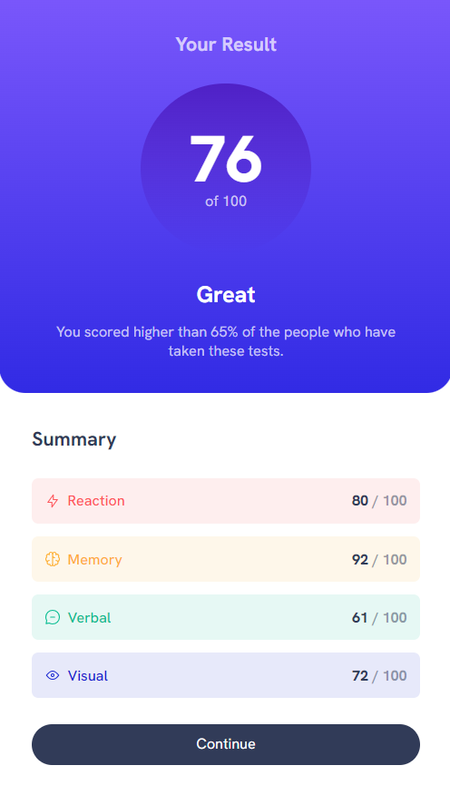
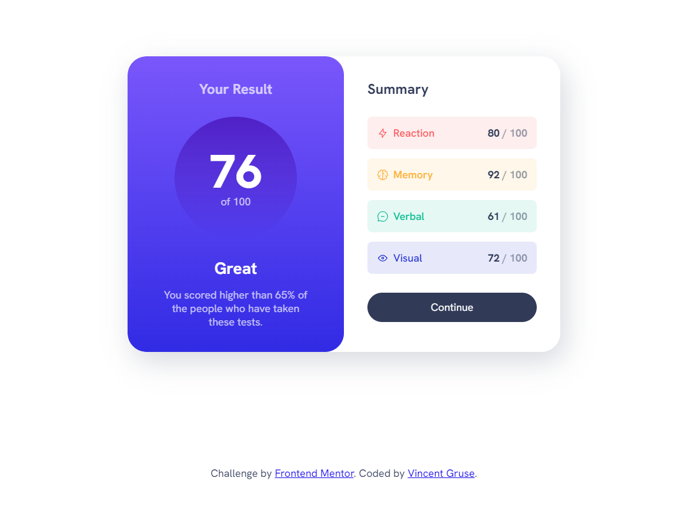

 # Frontend Mentor - Results summary component solution

This is a solution to the [Results summary component challenge on Frontend Mentor](https://www.frontendmentor.io/challenges/results-summary-component-CE_K6s0maV). Frontend Mentor challenges help you improve your coding skills by building realistic projects. 

## Table of contents

- [Overview](#overview)
  - [The challenge](#the-challenge)
  - [Screenshot](#screenshot)
  - [Links](#links)
- [My process](#my-process)
  - [Built with](#built-with)
  - [What I learned](#what-i-learned)
  - [Useful resources](#useful-resources)
- [Author](#author)

**Note: Delete this note and update the table of contents based on what sections you keep.**

## Overview

### The challenge

Users should be able to:

- View the optimal layout for the interface depending on their device's screen size
- See hover and focus states for all interactive elements on the page

### Screenshot

### Links

- Solution URL: (https://github.com/vincentgruse/results-summary-component)
- Live Site URL: (https://vincentgruse.github.io/results-summary-component)

## My process

### Built with

- Semantic HTML5 markup
- CSS

### What I learned

I learned about using variables for colors, padding, etc.  I still have a lot to improve on to reduce the length of development and troubleshooting.

### Useful resources

- [Resource 1](https://youtu.be/KqFAs5d3Yl8?si=uHpK2W2P4fPeTjGj) - Complete walkthrough, used portions to help me create my finished product

## Author

- Website - [Vincent Gruse](https://vincentgruse.github.io/)
- LinkedIN = [Vincent Gruse](https://www.linkedin.com/in/vincentgruse/)
- Frontend Mentor - [@grusvin10](https://www.frontendmentor.io/profile/grusvin10)
